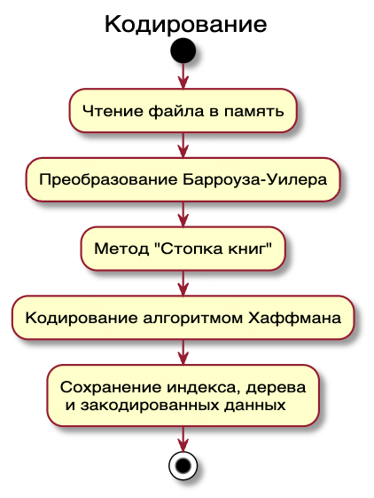
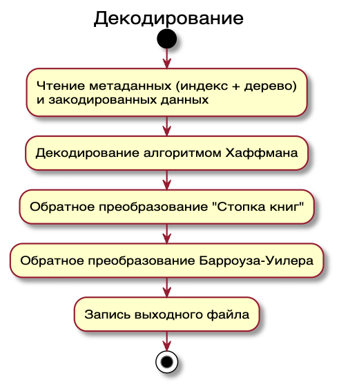

<h2 style="text-align: center;">
    МИНИСТЕРСТВО ОБРАЗОВАНИЯ И НАУКИ<br/>
    РОССИЙСКОЙ ФЕДЕРАЦИИ<br/>
    ФЕДЕРАЛЬНОЕ ГОСУДАРСТВЕННОЕ АВТОНОМНОЕ ОБРАЗОВАТЕЛЬНОЕ УЧРЕЖДЕНИЕ ВЫСШЕГО ОБРАЗОВАНИЯ
</h2>
<h3 style="text-align: center;">
    «Национальный Исследовательский Университет ИТМО»
</h3>
<h3 style="text-align: center; margin-bottom: 200px">
    Факультет информационных технологий и программирования
</h3>
<h4 style="text-align: center;">
    Лабораторная работа №1
</h4>
<center style="margin-bottom: 150px">
    <em>
        Программная реализация архиватора<br/>
    </em>
</center>
<p style="margin-left: 400px">Выполнил студент группы<br/> 
№M4106:<br/>
    <em>
        Папикян Сергей Седракович
    </em>
</p>
<p style="margin-left: 400px; margin-bottom: 250px">Проверил:<br/> 
    <em>
        Беляев Евгений Александрович
    </em>
</p>
<p style="text-align: center; margin-bottom: 50px">Санкт-Петербург<br/>2025</p>

# Задание

1. Написать кодер и декодер, которые работают как отдельные программы и запускаются с командной строки
2. В качестве параметра на вход кодера подается имя сжимаемого файла. На выходе программа выдаете файл со сжатыми данными
3. На вход декодера подается файл со сжатыми данными и имя декодированного файла. На выходе декодер выдает файл, который идентичен исходному (бит в бит)
4. Алгоритмы, относящиеся непосредственно к кодированию и декодированию должны быть реализованы без использования сторонних библиотек.

# Отчет

## Описание алгоритма кодирования и декодирования

В основе реализации архиватора лежит композиция трех алгоритмов:

- Преобразование Барроуза–Уилера
- Метода "Стопка книг"
- Код Хаффмана (улучшение - добавил энтропийное кодирование)

### **Кодирование**

На этапе кодирования весь входной файл загружается в память в виде массива байтов. Затем применяется алгоритм Барроуза–Уилера: формируется таблица всех циклических сдвигов входной строки, после чего она сортируется лексикографически. Результатом является последний столбец отсортированной таблицы, который и записывается в выходной поток, а также индекс строки, соответствующей исходному тексту. Далее применяется метод "Стопка книг": на каждом шаге символ заменяется на индекс своей позиции в алфавите, который динамически обновляется: недавно использованные символы перемещаются в начало. После, данные кодируются Хаффманом: строится таблица частот вхождения каждого байта, затем по ней строится бинарное дерево Хаффмана. Каждому символу сопоставляется уникальный префиксный код, более короткий для частых символов. Эти коды записываются в выходной поток в виде последовательности битов. Вместе с закодированными данными сохраняется дерево Хаффмана и  изначальный индекс преобразования Барроуза–Уилера



### **Декодирование**

Декодирование начинается с чтения метаданных. Сначала применяется декодер Хаффмана, который восстанавливает байтовую последовательность, основываясь на сохраненном дереве. Далее выполняется обратное преобразование "Стопка книг", восстанавливающее из последовательности индексов исходные байты. На последнем этапе используется обратное преобразование Барроуза–Уилера, читая из метаданных индекс строки, соответствующей исходной строки



## Результат работы на `Calgary corpus`

| File    | `H(X)`   |`H(X\|X)` |`H(X\|XX)`| Avg Bits per Symbol | Original Size (bytes)  | Compressed Size (bytes) |
|:--------|:--------:|:--------:|:--------:|:--------------------|:-----------------------|:------------------------|
| bib     | 5.200676 | 3.364127 | 2.307505 | 2.400122            | 111 261                | 33 380                  |
| book1   | 4.527149 | 3.584518 | 2.814074 | 2.781957            | 768 771                | 267 336                 |
| book2   | 4.792633 | 3.745216 | 2.735674 | 2.451484            | 610 856                | 187 188                 |
| geo     | 4.761897 | 4.043670 | 3.485526 | 7.629917            | 102 400                | 69 994                  |
| news    | 5.189632 | 4.091893 | 2.922759 | 2.836633            | 377 109                | 133 715                 |
| obj1    | 5.074431 | 3.254682 | 1.515338 | 6.217189            | 21 504                 | 12 216                  |
| obj2    | 5.396822 | 3.836606 | 2.364524 | 4.045209            | 246 814                | 89 164                  |
| paper1  | 4.982983 | 3.646085 | 2.331768 | 2.769850            | 53 161                 | 18 406                  |
| paper2  | 4.601435 | 3.522351 | 2.513645 | 2.756919            | 82 199                 | 28 327                  |
| paper3  | 4.665104 | 3.554845 | 2.559874 | 2.995830            | 46 526                 | 17 423                  |
| paper4  | 4.699726 | 3.477308 | 2.205155 | 3.403282            | 13 286                 | 5 652                   |
| paper5  | 4.936154 | 3.526005 | 2.041391 | 3.510791            | 11 954                 | 5 246                   |
| paper6  | 5.009503 | 3.611169 | 2.250973 | 2.837423            | 38 105                 | 13 515                  |
| pic     | 0.581502 | 0.508564 | 0.464635 | 1.713121            | 513 216                | 101 844                 |
| progc   | 5.199016 | 3.603391 | 2.134001 | 2.804877            | 39 611                 | 13 888                  |
| progl   | 4.770085 | 3.211607 | 2.043555 | 2.113949            | 71 646                 | 18 932                  |
| progp   | 4.868772 | 3.187547 | 1.755124 | 2.108103            | 49 379                 | 13 012                  |
| trans   | 5.500997 | 3.414096 | 1.946669 | 1.971644            | 93 695                 | 22 598                  |
|**Total**|          |          |          |                     | **3 251 493**          | **1 051 836**           |

## Исходный код

Исходный код опубликован в репозитории [https://github.com/I-SER-I/tarch](https://github.com/I-SER-I/tarch)

- `Tarch.CLI` - консольная версия архиватора
- `Tarch.Core` - библиотека с реализацией алгоритмов
  - `Algorithms` - алгоритмы
    - `BurrowsWheelerTransformMoveToFrontHuffmanAlgorithm` - реализация алгоритма Барроуза–Уилера с методом "Стопка книг" и кодированием алгоритмом Хаффмана

## Исполняемые программы

Исполняемые программы можно скачать из репозитория [https://github.com/I-SER-I/tarch/releases/tag/1.0](https://github.com/I-SER-I/tarch/releases/tag/1.0) соответственно для Windows (x86 и x64), Linux и MacOS (x64 и arm)

### Пример использования

**Вывод помощи**

```bash
tarch-win64.exe -h
```

```txt
USAGE:
    tarch [OPTIONS] <COMMAND>

OPTIONS:
    -h, --help    Prints help information

COMMANDS:
    encode <input file path> <output file path>    Encode file
    decode <input file path> <output file path>    Decode file
```

**Кодирование**

```bash
tarch-win64.exe encode .\data.txt .\archive
```

```txt
Encoding file data.txt
Encoded file archive
```

**Декодирование**

```bash
tarch-win64.exe decode .\archive .\data.decoded.text
```

```txt
Decoding file ./archive
Decoded file ./data.decode.txt
```